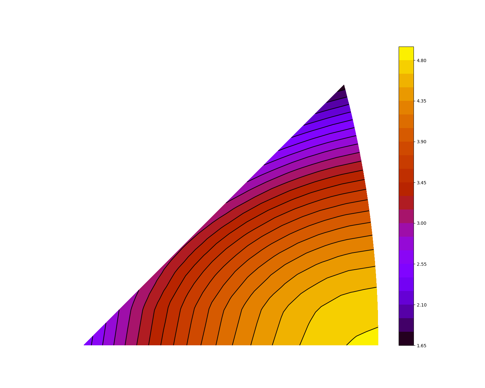
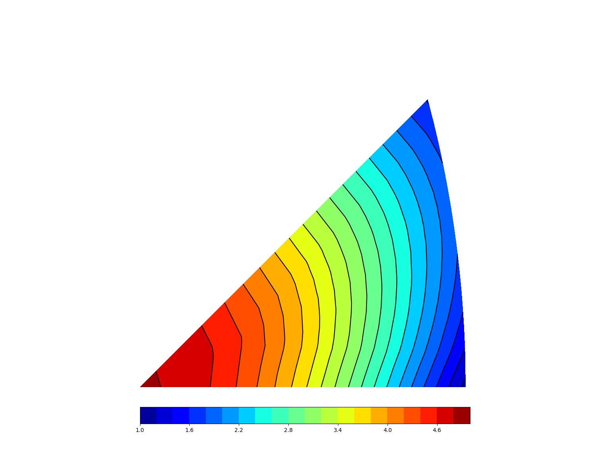

# Calculation of martensitic transformation strain under uniaxial tensile or compressive test.
This calculation method is based on crystrallography, and parameters used in this example below were brought by Ref[1].

## Overview

### Data
The data used in this example are described as follows
Composition : Ti-20 at.% Nb (a0 = 0.3285 nm, a = 0.3126 nm, b = 0.4870 nm, c = 0.4646 nm)
Transformation mode : BCC(β) to orthorhombic(α'')

### Calculation method
To define an inverse pole figure, mirror indecies are projected into xy coordinates system. 
Then, transformation strain for each variant along orientations are calculated.
Finally, those two values(transformation strains and mirror indices) are merged into xy coordinates system
and leave out the extra part so that only standard stereographic triangle can be shown.

### Model

Figure_1 shows the contour of favorable tensile transformation strain.
Figure_2 shows the contour of favorable compressive transformation strain.

## How to use
### Dependencies 
This calulator dependes on the following libraries:
* Numpy 1.21.1
* Matplotlib 3.3.4

Also, this code should be compatible with Python versions 2.7-3.7.

GUI option
* PyQt5 5.15.6
* qtmodern 0.2.0

### Run main.py or gui_calculatioin.py
You will get a contour figure of transformation strain that is similar with those two figures above. 

### Reference
[1] Kim, H.Y. and Miyazaki, S., 2018. Ni-free Ti-based shape memory alloys.
